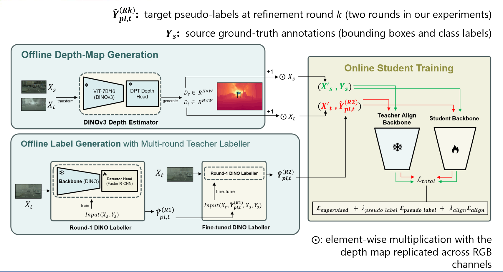

# Domain Adaptive Object Detection (DAOD) via Pseudo-Label Self-Training and Depth Priors

**Bài toán chính:** Phát hiện đối tượng thích nghi miền (Domain Adaptive Object Detection) theo hướng thích nghi miền không giám sát (Unsupervised Domain Adaptation - UDA) kết hợp tự huấn luyện (self-training) trên miền đích, nhằm giải quyết sự sai khác về điều kiện thời tiết giữa miền nguồn (thời tiết trong lành) và miền đích (thời tiết bất lợi như sương mù, mưa, ban đêm), gồm hai thành phần chính:

- **Multi-round Self-Training to refine pseudo-labels**: tự huấn luyện qua nhiều vòng, trong đó một mô hình "labeller" dựa trên DINOv2/DINOv3 sinh và tinh chỉnh dần nhãn giả (pseudo-label) trên miền đích qua từng vòng lặp.
- **Depth-Guided Spatial Modulation to incorporate depth priors**: điều biến không gian đặc trưng theo thông tin độ sâu (depth) nhằm bổ sung tri thức hình học, hỗ trợ mạng học sinh (student network) học tốt hơn trên miền đích.

**Pipeline đề xuất:**



## Cấu trúc thư mục

```
root/
├── configs/      # File cấu hình (YAML) cho các thí nghiệm huấn luyện/đánh giá
├── scripts/      # Script (.sh, .py) để chạy huấn luyện, sinh nhãn giả, đánh giá
├── notebooks/    # Notebook thực nghiệm, tiền xử lý, khám phá dữ liệu, minh họa cho luận văn
├── src/          # Mã nguồn chính (adapteacher, dinoteacher, dinov1/2/3, train_net.py)
├── weights/      # Nơi lưu trọng số tiền huấn luyện / checkpoint
├── outputs/      # Thư mục chứa kết quả (log, checkpoint, dự đoán) khi chạy huấn luyện/đánh giá
└── dataset/      # Dữ liệu thực nghiệm (ảnh, nhãn)
```

## Cài đặt môi trường

Xem hướng dẫn chi tiết tại [src/INSTALL.md](src/INSTALL.md). Tóm tắt:

- Python 3.10, numpy 1.26.4, torch 2.4.1+cu121
- (khuyến nghị) xformers 0.0.28.post1
- cityscapesscripts, shapely 2.1.0
- Detectron2 cài từ mã nguồn (commit `c69939a`)
- Môi trường thử nghiệm gốc: 1 GPU A100 (batch size 8 ảnh nguồn + 8 ảnh đích)

## Tổ chức dữ liệu

Dữ liệu thực nghiệm được đặt trong thư mục [dataset/](dataset/), hiện gồm tập Cityscapes:

```
dataset/
└── cityscapes/
    ├── gtFine/{train,val,test}/
    └── leftImg8bit/{train,val,test}/
```

Có thể bổ sung thêm các tập dữ liệu khác (ACDC, BDD100k, Cityscapes-Foggy, ...) theo cấu trúc được mô tả trong [src/INSTALL.md](src/INSTALL.md).

## Trọng số tiền huấn luyện

Đặt các trọng số tiền huấn luyện (VGG16 ImageNet, ResNet-50 Detectron2, DINOv2/DINOv3) vào thư mục [weights/](weights/). Danh sách nguồn tải tham khảo tại [src/INSTALL.md](src/INSTALL.md).

## Luồng huấn luyện

Các script điều khiển luồng huấn luyện nằm tại [scripts/](scripts/), chạy theo thứ tự sau:

1. `1.1_train_labeller_dinov3_source_only.sh`: huấn luyện mô hình labeller chỉ trên dữ liệu nguồn (source-only).
2. `1.2_gen_ps_labels.sh`: sinh nhãn giả (pseudo-label) cho tập huấn luyện của miền đích.
3. `1.3_train_labeller_dinov3_refine_target.sh`: tinh chỉnh labeller bằng nhãn giả trên miền đích.
4. `2_gen_ps_labels.sh`: sinh nhãn giả cho tập kiểm định (validation) của miền đích.
5. `3_train_student_depth.sh`: huấn luyện mạng học sinh (student network) kết hợp thông tin độ sâu (depth), sử dụng nhãn giả đã sinh.
6. `4_test.sh`: đánh giá mô hình đã huấn luyện.

Ghi chú backbone:

- **Labeller**: sử dụng backbone ViT-G (DINOv2/DINOv3).
- **Student network**: sử dụng ViT-B (DINOv3 ViT-B/16 distilled, 86M tham số, huấn luyện trên LVD-1689M) làm align teacher.

Tất cả script cần chạy với thư mục làm việc là [src/](src/) (nơi chứa `train_net.py`), tham số `--config` trỏ tới file trong [configs/](configs/) và `OUTPUT_DIR` trỏ tới thư mục con trong [outputs/](outputs/).

